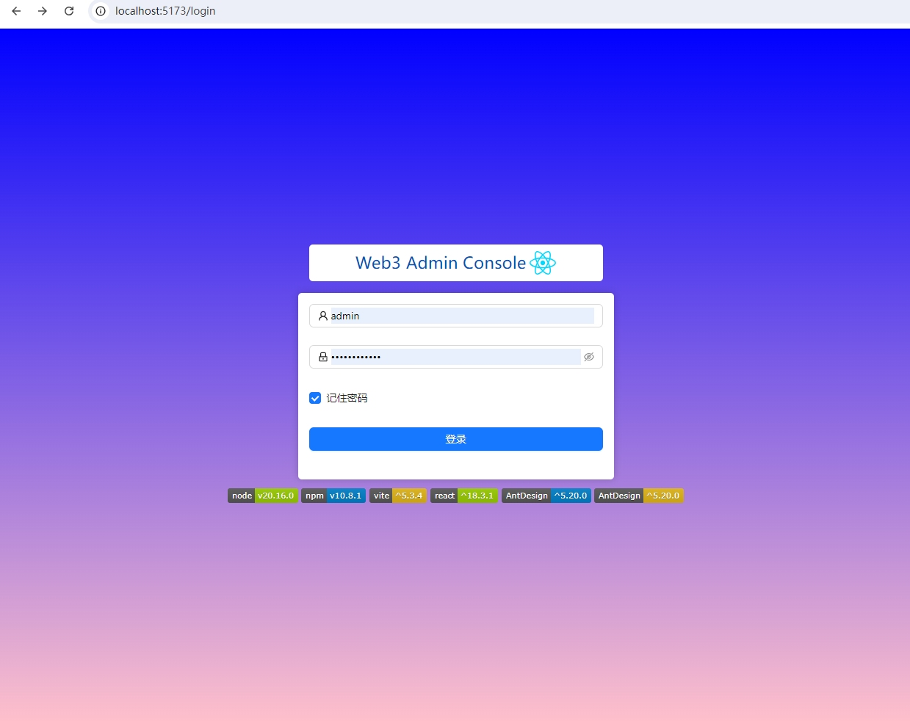
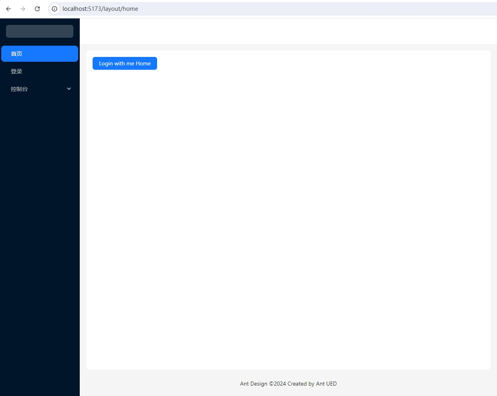

## React + TypeScript + Vite + AntDesign + tailwindcss

    
     
    
     
    
     
    
     
    
     
    
     
    

本项目旨在帮助大家快速理解和搭建一个React项目,不论是学习还是做项目,希望都能用得上.
如何一步一步搭建并理解react及其周边呢?

可以参考如下的文章:

[React+Antd+Vite+TypeScript 项目实战教程](https://blog.csdn.net/bobo789456123/article/details/130591757)

[Vite + React + Ant Design + Tailwind CSS + ESLint + Prettier + TypeScript 最佳实践](https://zhuanlan.zhihu.com/p/552344435)

### Preview(预览)

  
  

### 其他参考
如果需要一个较完整的、可直接用的、现代设计的Admin Console, 可参考
[Slash Admin](https://admin.slashspaces.com/#/dashboard/workbench)

**Slash Admin** is a modern admin dashboard template built with React 18, Vite, Ant Design, and TypeScript. It is designed to help developers quickly create powerful admin management systems.

## Tech Support(联系我)

  

